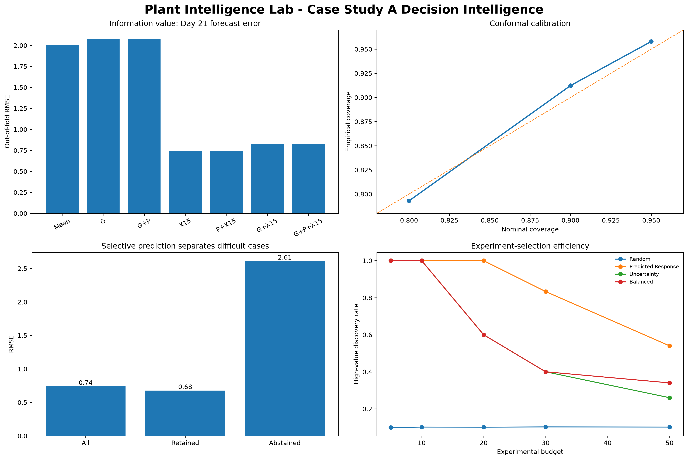

# Plant Intelligence Lab

## Genomic Prediction, Phenotype Forecasting & AI-Assisted Biological Decision Systems

> **Can we predict a plant phenotype from genomic information, environmental variables and early biological observations, while quantifying uncertainty?**

Plant Intelligence Lab is an open computational biotechnology project built around a practical question: **what information is actually useful for forecasting biological outcomes and making better experimental decisions?**

The repository combines quantitative genetics, high-dimensional machine learning, early phenotype forecasting, calibrated uncertainty, selective prediction, and retrospective experiment prioritization using real public plant data.

The current validated case study uses *Arabidopsis thaliana* shoot-regeneration data linked to 1001 Genomes resources. The study begins with more than 10.7 million raw SNP markers and 170 natural accessions, then evaluates genomic, phenotypic, and protocol information under genotype-aware validation.

## Validated Case Study A

### From genomic prediction to biological decision intelligence

The empirical sequence is deliberately cumulative:

$$
G
\rightarrow
\text{genomic prediction}
\rightarrow
G\times P
\rightarrow
X_{15}\rightarrow\widehat{Y}_{21}
\rightarrow
\text{prediction interval}
\rightarrow
\text{abstain / forecast}
\rightarrow
\text{experiment prioritization}
$$

where:

- $G$ denotes genomic information;
- $P$ denotes protocol or treatment context;
- $X_{15}$ is the observed Day-15 biological response;
- $\widehat{Y}_{21}$ is the forecast Day-21 response.

### Headline results

| Component | Validated result |
|---|---:|
| Raw SNP markers processed | **10,709,949** |
| SNP markers after QC | **1,257,793** |
| Genomic accessions used in modelling | **152** |
| Champion forecast | **$X_{15}\rightarrow Y_{21}$** |
| Out-of-fold $R^2$ | **0.8631** |
| Out-of-fold RMSE | **0.7397** |
| Predictive correlation | **0.9306** |
| 90% nominal interval empirical coverage | **91.23%** |
| Predictions retained after abstention | **98.60%** |
| Retained RMSE | **0.6766** |
| Abstained-case RMSE | **2.6113** |
| Budget-10 guided high-value hit rate | **100%** |
| Budget-10 random benchmark | **10.15%** |

The decision-engine summary is available in [`reports/results/case_study_a_decision_engine_summary.csv`](reports/results/case_study_a_decision_engine_summary.csv).



**Technical decision report:** [`Plant_Intelligence_Lab_Case_Study_A_Decision_Report.pdf`](reports/Plant_Intelligence_Lab_Case_Study_A_Decision_Report.pdf)

## What the data showed

### 1. Genomics alone was not enough

The genomic problem is strongly high-dimensional:

$$
p\gg n,
\qquad
p_{QC}=1{,}257{,}793,
\qquad
n=152.
$$

The project benchmarks **GBLUP — Genomic Best Linear Unbiased Prediction** against Elastic Net, Kernel Ridge, Random Forest, XGBoost, LightGBM, and PCA-based representations under the same genotype-aware folds.

GBLUP is represented by

$$
\mathbf{y}=\mathbf{X}\boldsymbol{\beta}+\mathbf{Z}\mathbf{u}+\boldsymbol{\varepsilon},
$$

with

$$
\mathbf{u}\sim\mathcal{N}(\mathbf{0},\mathbf{K}\sigma_g^2),
\qquad
\boldsymbol{\varepsilon}\sim\mathcal{N}(\mathbf{0},\mathbf{I}\sigma_e^2),
$$

where $\mathbf{K}$ is the genomic relationship matrix.

Across the regeneration targets, genomic-only models did not produce strong out-of-fold prediction. This result is retained rather than hidden: **more genomic variables did not automatically create better biological forecasts.**

### 2. Protocol response was heterogeneous

The same accessions were observed under two regeneration protocol variants. For each genotype,

$$
\Delta_g=Y_{g,B}-Y_{g,A}.
$$

At Day 15 the mean protocol shift was positive, while Day-21 responses displayed greater genotype-specific dispersion. Cross-protocol correlations remained substantial, showing that biological ranking was partly stable but not invariant to protocol.

This separates two questions that should not be confused: whether one protocol changes the population average, and whether individual genotypes respond differently to that change.

### 3. Early biological observation dominated the forecast

The information-ablation study compared

$$
\text{Mean},\quad G,\quad G+P,\quad X_{15},\quad P+X_{15},\quad G+X_{15},\quad G+P+X_{15}.
$$

The parsimonious model

$$
\boxed{X_{15}\rightarrow Y_{21}}
$$

was the strongest operational forecast:

$$
R^2=0.8631,
\qquad
RMSE=0.7397,
\qquad
\rho=0.9306.
$$

Adding genomic information to the early phenotype did not improve performance in this case study. The result therefore supports a broader principle: **complexity must earn its place through measurable predictive or decision value.**

### 4. Forecasts carry calibrated uncertainty

The forecasting layer uses conformal calibration rather than presenting point predictions as certainty.

For nominal coverage $1-\alpha$,

$$
P\left(L_{1-\alpha}(x)\leq Y_{new}\leq U_{1-\alpha}(x)\right)\approx1-\alpha.
$$

Observed pooled coverage was:

| Nominal coverage | Empirical coverage |
|---:|---:|
| 80% | **79.30%** |
| 90% | **91.23%** |
| 95% | **95.79%** |

Calibration remained similar across both protocol variants.

### 5. The system can abstain

A prediction system should be able to say that evidence is insufficient.

The reliability layer therefore exposes

$$
\text{status}(x)\in\{\text{FORECAST},\text{ABSTAIN}\}.
$$

Only 4 of 285 retrospective predictions were abstained, so this result should not be overgeneralized. In this dataset, however, the abstained cases were substantially harder: retained RMSE was **0.6766**, compared with **2.6113** for the four abstained observations.

### 6. Predictions become experimental priorities

The decision layer evaluates three objectives:

**EXPLOIT**

$$
x^*_{exploit}=\arg\max_x\widehat{Y}_{21}(x)
$$

prioritizes expected biological response.

**EXPLORE**

$$
x^*_{explore}=\arg\max_x U(x)
$$

prioritizes uncertain observations that may be informative to investigate.

**BALANCED**

$$
A(x)=0.5R_{\widehat{Y}}(x)+0.5R_U(x)
$$

combines response and uncertainty ranks.

At an experimental budget of 10 observations, predicted-response ranking retrospectively identified 10/10 high-value outcomes, compared with an average random-selection hit rate of 10.15%.

**This is a retrospective acquisition benchmark, not a prospective laboratory trial.** It demonstrates enrichment within the evaluated public dataset; it does not establish that a real laboratory would reduce experiments by the same percentage.

## Decision engine

The current quantitative engine connects:

$$
\boxed{
X_t
\rightarrow
\widehat{Y}_{t+h}
\rightarrow
PI
\rightarrow
\text{Reliability}
\rightarrow
\text{Decision objective}
\rightarrow
\text{Recommended experiment}
}
$$

The purpose is not to automate biological judgement. It is to expose prediction, uncertainty, reliability, and experimental priorities in a traceable quantitative system.

## Public data foundation

Case Study A uses public biological resources including:

- **1001 Genomes Project** for *Arabidopsis thaliana* genomic variation;
- **AraPheno** phenotype resources;
- public shoot-regeneration measurements for natural accessions under two protocol variants.

No proprietary biotechnology data are used in the repository.

## Validation design

The project avoids naive random splitting when genomic relatedness can leak biological structure between training and test observations. Case Study A uses genotype-aware folds consistently across the quantitative comparison.

Feature transformations that learn from data are fitted inside training folds where applicable. Downstream uncertainty and decision analyses operate on validated out-of-fold forecasts.

Core evaluation includes RMSE, MAE, $R^2$, predictive correlation, interval coverage, interval width, retained-versus-abstained error, and retrospective selection efficiency.

## Reproducibility

The repository contains two complementary GitHub Actions workflows:

- **Full real-data execution** — rebuilds the Case Study A empirical pipeline from public phenotype and genomic inputs through genomic modelling and forecasting.
- **Downstream analysis** — reuses validated compact outputs for uncertainty, experiment selection, and decision-engine reporting without unnecessarily recomputing the full genomic stack.

Install the core package with:

```bash
python -m pip install -e .
```

Run the current downstream quantitative modules with:

```bash
python -m plant_intelligence.uncertainty.conformal
python -m plant_intelligence.optimization.active_learning
python -m plant_intelligence.optimization.decision_engine
```

## Repository structure

```text
plant-intelligence-lab/
├── .github/workflows/
│   ├── case-study-a.yml
│   └── downstream-analysis.yml
├── data/
│   └── README.md
├── docs/
│   ├── Plant_Intelligence_Lab_Technical_Architecture.pdf
│   ├── biological_context.md
│   ├── limitations.md
│   ├── methodology.md
│   └── transferability.md
├── notebooks/
│   ├── 01_data_discovery.ipynb
│   ├── 02_genomic_structure.ipynb
│   └── 03_genomic_prediction.ipynb
├── reports/
│   ├── Plant_Intelligence_Lab_Case_Study_A_Decision_Report.pdf
│   ├── figures/
│   └── results/
├── src/plant_intelligence/
│   ├── data/
│   ├── forecasting/
│   ├── genetics/
│   ├── models/
│   ├── optimization/
│   └── uncertainty/
├── tests/
├── CITATION.cff
├── pyproject.toml
└── README.md
```

This structure reflects the repository as implemented. Public documentation does not present unimplemented directories or modules as if they already existed.

## Industrial relevance

The methods demonstrated here are transferable to biotechnology problems involving early biological monitoring, propagation and regeneration analytics, high-dimensional omics, treatment-response modelling, experimental prioritization, and uncertainty-aware decision support.

The relevant industrial question is not whether one model can be copied unchanged into another laboratory. It is whether the quantitative architecture can be adapted to the available biological process, measurements, decision horizon, and operational objective.

## Limits on interpretation

Performance claims in this repository apply to the evaluated public Case Study A data and validation design.

The project does **not** claim:

- causal biological mechanisms from predictive associations;
- prospective laboratory savings from the retrospective experiment-selection benchmark;
- validated performance on proprietary commercial processes;
- automatic transfer of fitted models across species, laboratories, or production conditions;
- that genomic information is generally unimportant because it did not improve this particular early forecast.

See [`docs/limitations.md`](docs/limitations.md) for the full limitation framework.

## Documentation

- [`docs/methodology.md`](docs/methodology.md) — quantitative methodology
- [`docs/biological_context.md`](docs/biological_context.md) — biological context
- [`docs/limitations.md`](docs/limitations.md) — interpretation boundaries
- [`docs/transferability.md`](docs/transferability.md) — transfer from public demonstrations to biotechnology applications
- [`docs/Plant_Intelligence_Lab_Technical_Architecture.pdf`](docs/Plant_Intelligence_Lab_Technical_Architecture.pdf) — technical architecture document
- [`reports/Plant_Intelligence_Lab_Case_Study_A_Decision_Report.pdf`](reports/Plant_Intelligence_Lab_Case_Study_A_Decision_Report.pdf) — validated Case Study A decision report

## Scientific principles

1. **Real data before synthetic demonstration.**
2. **Generalization matters more than in-sample fit.**
3. **Prediction is not causation.**
4. **Biological and temporal leakage must be prevented.**
5. **Uncertainty is part of the prediction.**
6. **A model should abstain when evidence is insufficient.**
7. **Complexity must earn measurable value.**
8. **Experimental recommendations must remain traceable to validated quantitative outputs.**
9. **Retrospective evidence must not be presented as prospective validation.**
10. **Results should be reproducible.**

## Citation

Pereira, Rodolfo. (2026). *Plant Intelligence Lab: Genomic Prediction, Phenotype Forecasting & AI-Assisted Biological Decision Systems*. ShockBridge Pulse Research Lab. Python research software.

See [`CITATION.cff`](https://github.com/rolffcoelho-bravo/plant-intelligence-lab/blob/main/CITATION.cff) for machine-readable citation metadata.

## Disclaimer

This project is for research, education, reproducible benchmarking, and professional portfolio demonstration. It does not provide biological, agronomic, breeding, laboratory, regulatory, production, or commercial recommendations; it does not establish prospective laboratory performance; and it is not a substitute for domain-specific experimental validation, biosafety review, or institution-specific decision processes.

---

**Plant Intelligence Lab**  
Rodolfo Pereira · ShockBridge Pulse Research Lab
