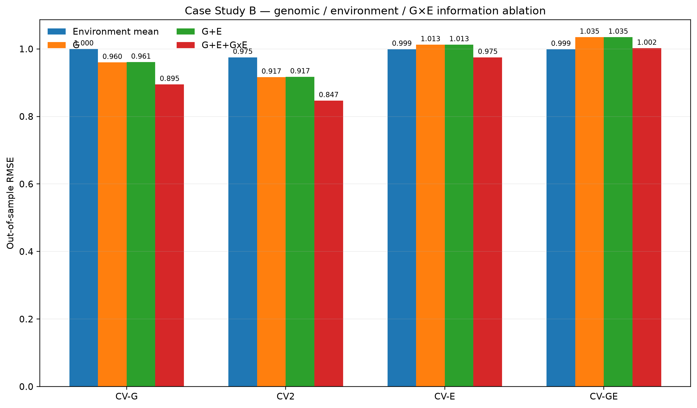
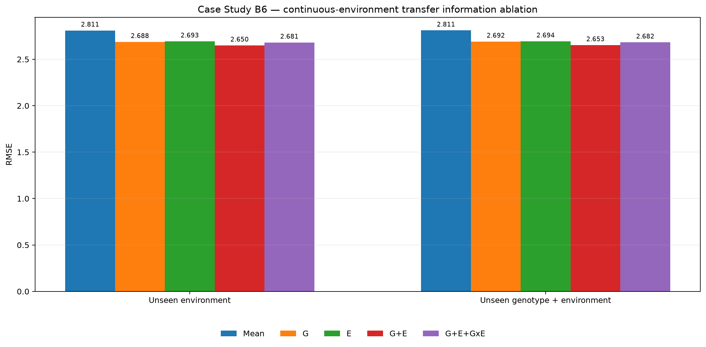
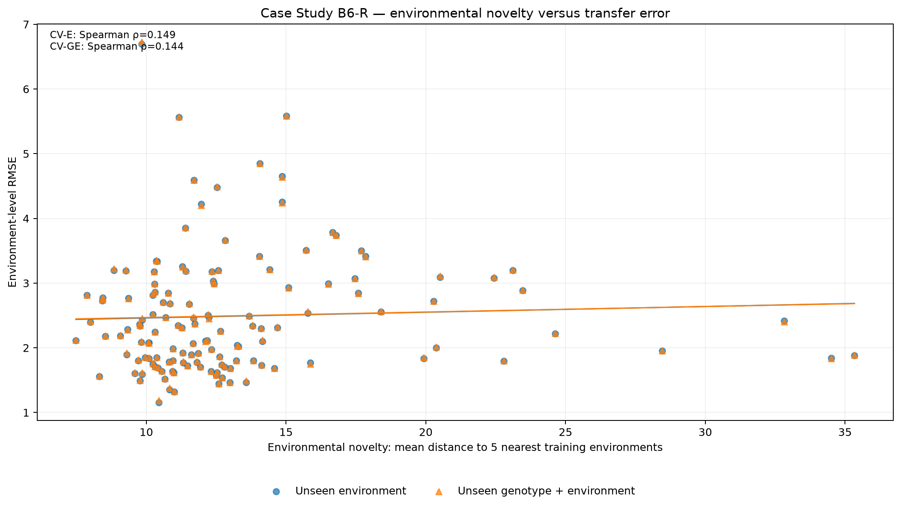
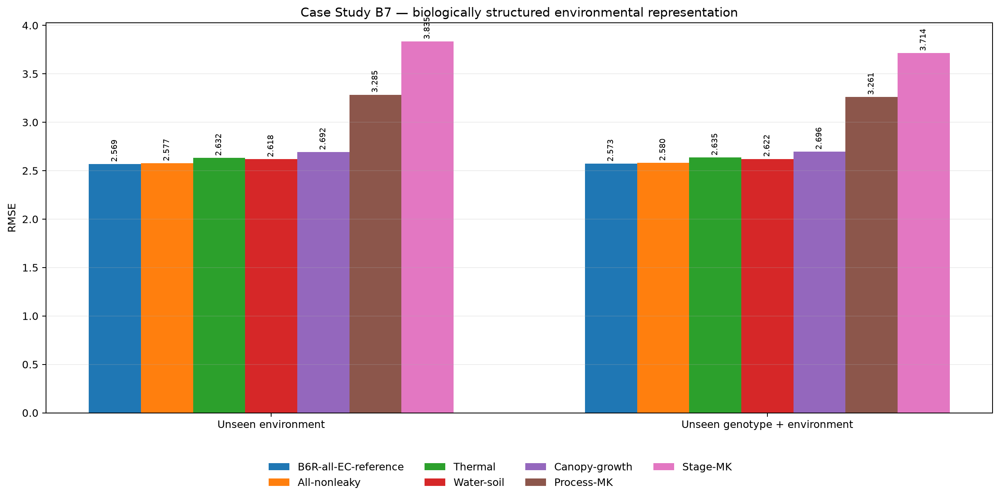
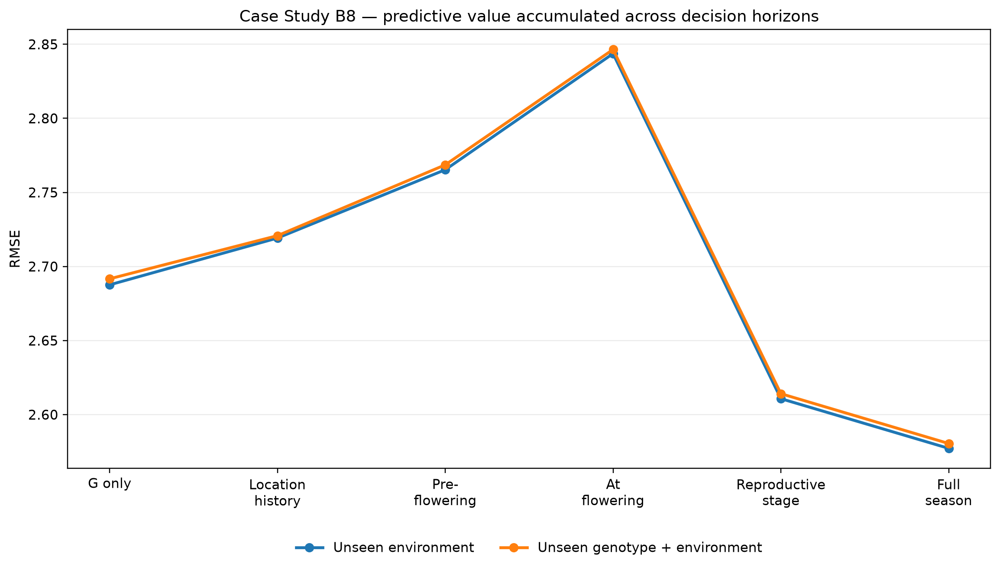
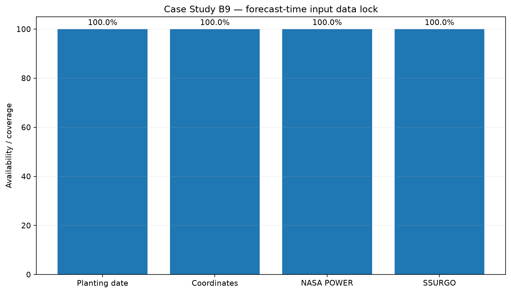

# Plant Intelligence Lab

## Genomic Prediction, Phenotype Forecasting & AI-Assisted Biological Decision Systems

> **Can we predict a plant phenotype from genomic information, environmental variables and early biological observations, while quantifying uncertainty?**

Plant Intelligence Lab is an open computational biotechnology project built around a practical question: **what information is actually useful for forecasting biological outcomes and making better experimental decisions?**

The repository combines quantitative genetics, high-dimensional machine learning, multi-environment genomic prediction, early phenotype forecasting, calibrated uncertainty, selective prediction, retrospective experiment prioritization, continuous-environment transfer, biological environmental representation, decision-horizon forecasting, prospective environmental-state reconstruction, and a grounded scientific interface using real public plant data.

The empirical program has two complementary case studies:

- **Case Study A — Arabidopsis longitudinal decision intelligence:** genomic prediction, protocol response, Day-15 → Day-21 phenotype forecasting, uncertainty, abstention, and retrospective experiment prioritization.
- **Case Study B — Genotype × environment and environmental transfer:** wheat establishes predictive G×E value within represented environments and exposes the categorical-environment transfer limit; a larger Genomes-to-Fields maize extension tests transfer to physically characterized unseen environments, asks which environmental information is useful, maps when that information becomes predictive, and reconstructs forecast-time-safe environmental states.

---

# Case Study A — Arabidopsis longitudinal forecasting

The validated sequence is

$$
G
\rightarrow
\text{genomic prediction}
\rightarrow
G\times P
\rightarrow
X_{15}\rightarrow\widehat{Y}_{21}
\rightarrow
PI
\rightarrow
\text{reliability}
\rightarrow
\text{experiment prioritization}.
$$

### Headline evidence

| Component | Validated result |
|---|---:|
| Raw SNP markers processed | **10,709,949** |
| SNP markers after QC | **1,257,793** |
| Genomic accessions used in modelling | **152** |
| Champion forecast | **$X_{15}\rightarrow Y_{21}$** |
| Out-of-fold $R^2$ | **0.8631** |
| Out-of-fold RMSE | **0.7397** |
| Predictive correlation | **0.9306** |
| 90% nominal interval empirical coverage | **91.23%** |
| Predictions retained after abstention | **98.60%** |
| Retained RMSE | **0.6766** |
| Abstained-case RMSE | **2.6113** |
| Budget-10 guided high-value hit rate | **100%** |
| Budget-10 random benchmark | **10.15%** |

The high-dimensional genomic-only benchmark does **not** produce strong out-of-fold prediction. Early phenotype $X_{15}$ dominates the Day-21 forecast, and adding genomic information to $X_{15}$ does not improve performance in this dataset. The result is retained rather than hidden: **complexity must earn measurable predictive or decision value.**

The protocol analysis also shows response heterogeneity. Protocol B has a supported positive Day-15 average shift, while Day-21 mean advantage is uncertain and genotype-specific protocol response remains substantial.

The forecasting layer adds cross-fold residual calibration and a selective-prediction state. The abstention result involves only four observations and is therefore reported as dataset-specific evidence rather than a universal rule.

The experiment-selection layer is a **retrospective post-Day-15 prioritization benchmark**, not a prospective laboratory trial and not a claim of laboratory cost reduction.


**Technical decision report:** [`reports/Plant_Intelligence_Lab_Case_Study_A_Decision_Report.pdf`](reports/Plant_Intelligence_Lab_Case_Study_A_Decision_Report.pdf)

---

# Case Study B — Genotype × Environment and environmental transfer

Case Study B develops the environmental dimension of the architecture:

$$
\boxed{G+E+G\times E\rightarrow Y}.
$$

It is deliberately staged. The wheat benchmark first asks whether explicit G×E structure adds predictive value when environmental regimes are represented. The maize extension then addresses the harder question created by the wheat failure diagnostic: **can an unseen but physically characterized environment be predicted from measurable environmental similarity?**

## B1–B4 — Wheat G×E benchmark

The executable wheat data lock uses the canonical BGLR multi-environment wheat resource sourced from CIMMYT.

| Component | Verified result |
|---|---:|
| Wheat lines | **599** |
| DArT markers | **1,279** |
| Mega-environments | **4** |
| Line × environment phenotype cells | **2,396** |
| Marker-to-line ratio $p/n$ | **2.135** |
| CV-G G+E+G×E RMSE | **0.8949** |
| CV-G G+E+G×E $R^2$ | **0.1978** |
| CV2 G+E+G×E RMSE | **0.8469** |
| CV2 G+E+G×E $R^2$ | **0.2444** |

The validation design was locked before model fitting:

- **CV-G / CV1:** whole genotypes are held out across represented environments.
- **CV2:** one environment response is masked while a genotype remains observed in other represented environments.
- **CV-E:** one complete categorical mega-environment is withheld.
- **CV-GE:** genotype and categorical environment are simultaneously unseen.

The classical ablation is

$$
\text{Environment mean}
\rightarrow G
\rightarrow G+E
\rightarrow G+E+G\times E.
$$

Under CV-G and CV2, explicit G×E structure materially improves the classical benchmark and paired genotype-cluster bootstrap intervals support the incremental gain.

The strict categorical CV-GE stress test instead reaches approximately

$$
RMSE=1.0021,
\qquad
R^2=-0.0058,
$$

showing that a categorical environment identifier does not supply the information required to infer similarity to a new environment.

B4 adds calibrated uncertainty for the supported CV-G/CV2 regimes. Pooled empirical coverage is close to nominal at 80%, 90%, and 95%. Interval width is not a useful error-ranking signal in this benchmark, while genomic-support distance has only a weak positive association with error. Therefore the repository does **not** manufacture an arbitrary abstention threshold. CV-E and CV-GE are explicitly classified as `UNSUPPORTED_ENVIRONMENT` when only categorical environment labels are available.



## B5 — Continuous-environment transfer data lock

To attack the categorical-environment limitation directly, Case Study B adds the curated Genomes-to-Fields maize resource from Figshare, with genotype, phenotype, and measured environmental covariates.

| Component | Verified result |
|---|---:|
| Phenotype records | **78,686** |
| Genotyped / phenotyped hybrids | **4,372** |
| SNP markers | **98,026** |
| Year-location environments | **136** |
| Environmental covariates in the curated matrix | **202** |
| Environment covariate missing fraction | **0.0** |
| Phenotype ↔ environment overlap | **136 / 136** |
| Phenotype ↔ genomic overlap | **4,372 / 4,372** |
| Study years | **2014–2021** |

The outer validation manifests were frozen before B6 modeling:

$$
E_{test}\cap E_{train}=\varnothing,
\qquad
\mathbf e_{test}\text{ observed},
$$

for five environment cold-start folds, plus 25 crossed scenarios satisfying

$$
G_{test}\cap G_{train}=\varnothing,
\qquad
E_{test}\cap E_{train}=\varnothing,
\qquad
\mathbf e_{test}\text{ observed}.
$$

## B6 — Does measurable environmental similarity transfer?

B6 builds scalable train-partition relationship representations from all **98,026 SNP markers** and **202 environmental covariates**.

The genomic side uses a deterministic CountSketch followed by train-partition PCA to define a low-rank approximation to a linear genomic kernel. The environmental side uses a train-standardized exact RBF environment kernel and a Nyström map. Their tensor-product feature map represents

$$
K_{G\times E}=K_G\odot K_E.
$$

Plot-level phenotype records are aggregated to **52,167 genotype-environment means** so replicate plots are not treated as independent deployment cases.

### First unseen-environment benchmark

| Model | CV-E RMSE | CV-GE RMSE |
|---|---:|---:|
| Mean | 2.8105 | 2.8109 |
| G | 2.6876 | 2.6917 |
| E | 2.6935 | 2.6939 |
| **G+E** | **2.6495** | **2.6527** |
| G+E+G×E | 2.6812 | 2.6825 |

Continuous environment information enables a legitimate prediction problem for unseen environments, but the first `G+E` representation improves RMSE over genomics alone by only about 1.4%, with environment-cluster intervals crossing zero. The simple multiplicative G×E kernel also does not earn a pooled RMSE advantage.

That distinction is central:

$$
\boxed{\text{environment representation enables transfer}}
$$

but

$$
\boxed{\text{the first representation does not establish a robust transfer gain}}.
$$



## B6-R — Transfer robustness and environmental novelty

B6-R keeps every B5 outer fold fixed and applies a **nine-configuration nested robustness neighborhood** around the B6 representation. The inner search varies environmental RBF bandwidth, environmental rank, genomic rank, and ridge regularization; selection uses additive `G+E` only, and the selected representation is then reused unchanged for the interaction challenger and strict double-cold-start scenarios.

Three outer folds select a **narrower environmental kernel**, while two select a **higher environmental rank**. None selects a different genomic rank or ridge penalty. This points to environmental geometry, rather than generic genomic complexity, as the main representation bottleneck.

| Regime | Model | RMSE | MAE | $R^2$ | Correlation |
|---|---|---:|---:|---:|---:|
| Unseen environment | B6 fixed G+E | 2.6495 | 2.1232 | 0.0958 | 0.3497 |
| Unseen environment | Selected G | 2.6876 | 2.1524 | 0.0696 | 0.2722 |
| **Unseen environment** | **Selected G+E** | **2.5693** | 2.0507 | 0.1497 | 0.4002 |
| Unseen environment | Selected G+E+G×E | 2.5666 | **2.0445** | **0.1514** | **0.4260** |
| Double cold start | B6 fixed G+E | 2.6527 | 2.1261 | 0.0936 | 0.3474 |
| Double cold start | Selected G | 2.6917 | 2.1558 | 0.0668 | 0.2681 |
| **Double cold start** | **Selected G+E** | **2.5726** | 2.0537 | 0.1475 | 0.3979 |
| Double cold start | Selected G+E+G×E | 2.5724 | **2.0499** | **0.1477** | **0.4229** |

Nested representation selection improves additive `G+E` RMSE by about **3.0%** over the fixed B6 representation in both deployment regimes. Relative to selected genomics alone, the point-estimate improvement is about **4.4%**.

The environment-cluster intervals for `Selected-G+E − Selected-G` still narrowly cross zero, so the project does **not** claim a universal 95%-robust transfer gain. The explicit product interaction contributes essentially no further RMSE reduction after representation tuning and is not promoted as a transfer champion.

Environmental novelty is also measurable. Nearest-training-environment novelty has a weak positive association with environment-level RMSE, and the highest-novelty quartile is about **0.38 RMSE units harder** than the lowest-novelty quartile. This supports environmental support distance as a candidate reliability signal, but not yet as a hard abstention threshold.



## B7 — Which environmental information is actually useful?

B7 freezes the B5 folds and the B6-R outer-fold representation choices. It then audits the environmental matrix and tests biologically structured information blocks without opening another hyperparameter search.

Five `yield_*` environmental columns are treated conservatively as **target-proximal crop-model outputs** and excluded from every new B7 candidate. The frozen B6-R all-EC model remains only as a sensitivity reference. That leaves **197** environmental covariates for the leakage-conservative B7 candidates.

The retained environmental information is separated into process blocks and phenological blocks:

| Block | Retained covariates |
|---|---:|
| Thermal | **36** |
| Water / soil | **125** |
| Canopy / growth | **36** |
| Vegetative | **66** |
| Reproductive transition | **66** |
| Grain fill / maturity | **65** |

### Biological representation results

| Environmental representation | CV-E RMSE | CV-GE RMSE |
|---|---:|---:|
| B6-R all-EC sensitivity reference | 2.5693 | 2.5726 |
| All non-target-proximal | 2.5772 | 2.5805 |
| Thermal | 2.6315 | 2.6351 |
| Water / soil | 2.6183 | 2.6215 |
| Canopy / growth | 2.6923 | 2.6963 |
| Vegetative | **2.8437** | **2.8465** |
| **Reproductive transition** | **2.5729** | **2.5765** |
| Grain fill / maturity | 2.6510 | 2.6547 |
| **Process multiple kernel** | **2.5610** | **2.5642** |
| Stage multiple kernel | 2.6002 | 2.6037 |

Three results matter most.

First, excluding the five target-proximal crop-model outputs changes pooled RMSE by only about **+0.008** in either regime, and the paired environment-cluster intervals cross zero. The B6-R transfer result is therefore not materially dependent on those five variables in this sensitivity test.

Second, the **66-variable reproductive-transition representation nearly recovers the all-EC point performance**, while vegetative-only information is decisively weaker. Relative to the all-EC reference, vegetative-only RMSE is about **+0.274** worse in both regimes, with 95% environment-cluster intervals entirely above zero.

Third, an equal-weight process-specific multiple kernel gives the best pooled point estimate, but its advantage is tiny: about **-0.008 RMSE** versus the all-EC sensitivity reference, with intervals crossing zero. It is therefore an interpretability/representation result, **not a robust accuracy breakthrough**.



## B8 — When does environmental information become useful?

B8 keeps the B5 cold-start folds and the B6-R outer-fold representation settings fixed. It accumulates only non-target-proximal environmental information through successive source phenological intervals.

| Decision-horizon representation | CV-E RMSE | CV-GE RMSE |
|---|---:|---:|
| Pre-season G only | 2.6876 | 2.6917 |
| Pre-season training-location history | 2.7160 | 2.7177 |
| Pre-flowering proxy — 44 ECs | 2.7653 | 2.7686 |
| Through `EnJFlo` — 66 ECs | 2.8437 | 2.8465 |
| **Through reproductive stage — 132 ECs** | **2.6108** | **2.6141** |
| Full-season non-target-proximal — 197 ECs | **2.5772** | **2.5805** |

The result is **not monotonic information accumulation**. Historical-location information does not improve RMSE over genomics alone, and the early current-year representations are weaker under the frozen model. The large transition occurs when the cumulative representation expands through the reproductive-stage intervals: RMSE falls by **8.19%** in CV-E and **8.16%** in CV-GE relative to the preceding 66-variable horizon.

That transition is robust to the 2,000-replicate environment-cluster bootstrap. The reproductive-stage minus preceding-horizon RMSE difference is **-0.2329** with 95% interval **[-0.3688, -0.0933]** in CV-E and **-0.2324** with interval **[-0.3791, -0.0953]** in CV-GE. Improvement frequency is **1.000** in both regimes.

The additional full-season improvement beyond the reproductive-stage representation is small and its environment-cluster interval crosses zero. Likewise, reproductive-stage performance is better than G-only in the pooled point estimate, but that comparison is not 95%-robust across environment clusters.

A critical deployment boundary is explicit. The G2F ECOV source was constructed retrospectively with APSIM phenological intervals whose year-location flowering calibration used average observed silking. Therefore the current-year B8 horizons are **retrospective information-frontier proxies**, not prospective live forecasts. The pre-season history representation uses no held-out current-year ECOV row, but the frozen environment folds are not forward-time folds.



## B9 — Forecast-time-safe environmental states

B9 does **not** fit a new predictor. It converts the deployment limitation exposed by B8 into a reproducible data and validation lock. The retrospective APSIM stage summaries are replaced, for this new experiment, by environmental states whose information is explicitly bounded by forecast issuance time.

Three states are frozen:

| Forecast state | Current-year realized weather admitted | Future weather | Observed anthesis/silking/yield |
|---|---|---|---|
| **T0 pre-season** | none | **No** | **No** |
| **T1 — 30 DAP** | planting → 30 days after planting | **No** | **No** |
| **T2 — 60 DAP fixed-time proxy** | planting → 60 days after planting | **No** | **No** |

The executed audit covers **136 environments** from 2014–2021, resolves planting dates and coordinates for **100%** of environments, acquires NASA POWER weather at **113 unique coordinates** with zero missingness in the locked weather audit, obtains SSURGO point soil information at every queried coordinate, and produces **408** issuance-safe environment-state rows. The machine audit records **0 future-weather violations** and **0 observed-phenology violations**.

B9 also preserves the original B5 CV-E/CV-GE manifests unchanged and registers a separate chronological validation before modeling:

$$
\max(year_{train}) < year_{test}.
$$

The locked forward-year tests cover **113 environments** across six test years, 2016–2021. B9 intentionally reports **no prediction-performance result**: the next model must consume these states and manifests without redefining the horizons after seeing performance.



A critical boundary remains: B9 reconstructs historical observations as if they were cut off at the issuance date. It is therefore a **retrospective forecast-time-safe backtest substrate**, not a live prospective trial and not an archived weather-forecast benchmark.

Detailed Case Study B evidence:

- [`docs/case_study_b_environment_transfer.md`](docs/case_study_b_environment_transfer.md) — B5/B6 data and first transfer benchmark
- [`docs/case_study_b_transfer_robustness.md`](docs/case_study_b_transfer_robustness.md) — B6-R nested robustness and novelty audit
- [`docs/case_study_b_biological_environment.md`](docs/case_study_b_biological_environment.md) — B7 target-proximal audit, process/stage ablations, and multiple-kernel evidence
- [`docs/case_study_b_decision_horizons.md`](docs/case_study_b_decision_horizons.md) — B8 decision-horizon information ablation
- [`docs/case_study_b_prospective_environment.md`](docs/case_study_b_prospective_environment.md) — B9 forecast-time-safe input and forward-year validation lock
- [`docs/case_study_b_decision_horizons.md`](docs/case_study_b_decision_horizons.md) — B8 availability audit and decision-horizon information frontier

---

# Grounded scientific interface

The GenAI-facing layer is evidence-first:

$$
\boxed{
\text{Question}
\rightarrow
\text{validated evidence}
\rightarrow
\text{grounding packet}
\rightarrow
\text{provider adapter}
\rightarrow
\text{claim verification}
\rightarrow
\text{answer / withholding}
}
$$

The grounding packet carries selected quantitative evidence, exact source files, an answerability state, and instructions preserving uncertainty, retrospective-versus-prospective distinctions, and causality limits.

A provider-independent adapter allows an external API, local model, or callable generator to be connected without changing the evidence layer. The deterministic reference adapter is used for reproducible CI validation; it is **not** presented as an external-LLM performance result.

### Grounding benchmark — deterministic reference adapter

| Metric | Result |
|---|---:|
| Benchmark cases | **11** |
| Grounded Scientific Answer Rate | **100%** |
| Supported-case pass rate | **100%** |
| Unsupported safe-response rate | **100%** |
| Source traceability rate | **100%** |
| Numerical claims checked | **49** |
| Verification failures | **0** |

The benchmark validates the grounding/verification software contract, not the scientific accuracy of an arbitrary external LLM.

---

# Public data foundation

The repository uses only public research data:

- **Case Study A:** 1001 Genomes + AraPheno, *Arabidopsis thaliana*.
- **Case Study B wheat:** BGLR/CIMMYT multi-environment wheat benchmark.
- **Case Study B environmental-transfer extension:** curated Genomes-to-Fields maize genotype, phenotype, and environmental-covariate resource.

No proprietary biotechnology data are used.

# Validation principles

The project avoids naive random splitting when biological structure can leak between train and test partitions. Genotype-aware, environment-aware, sparse multi-environment, and double-cold-start manifests are defined explicitly for the deployment problem being tested.

Feature transformations that learn from biological measurements are fitted on the relevant outer training partition. B6 uses a common fixed ridge penalty for the first information-ablation experiment. B6-R performs a deliberately small nested representation search **inside each outer training partition**. B7 freezes those B6-R choices and changes only the environmental information block, with the five target-proximal `yield_*` outputs excluded from every new candidate. B8 then measures retrospective information accumulation across source stages. B9 freezes three issuance-time states and a separate forward-year manifest before any prospective-input model is fitted. B8 keeps those representation choices frozen again and changes only the information horizon; post-horizon environmental columns are prohibited from earlier horizons.

Core evaluation includes RMSE, MAE, $R^2$, predictive correlation, interval calibration, selective risk, environment-specific performance, paired cluster-bootstrap uncertainty, environmental-support diagnostics, biological information ablation, decision-horizon availability auditing, and grounded-answer verification.

# Reproducibility

GitHub Actions separates lightweight software checks from real-data executions. Current workflows include:

- `ci.yml` — lightweight unit tests;
- `grounded-ai-evaluation.yml` — grounded scientific answer evaluation;
- `case-study-a.yml` — full Case Study A real-data rebuild;
- `downstream-analysis.yml` — Case Study A uncertainty, selection and decision outputs;
- `case-study-b-data-lock.yml` — wheat data lock;
- `case-study-b-modeling.yml` — classical wheat G×E benchmark and robustness;
- `case-study-b-ml.yml` — frozen-baseline high-dimensional ML challengers;
- `case-study-b-uncertainty.yml` — wheat uncertainty and deployment boundaries;
- `case-study-b5-data-lock.yml` — continuous-environment Genomes-to-Fields data lock;
- `case-study-b6-environment-transfer.yml` — first unseen-environment and double-cold-start transfer benchmark;
- `case-study-b6r-transfer-robustness.yml` — nested environmental-representation robustness and novelty audit;
- `case-study-b7-process-kernels.yml` — target-proximal audit and biological process/phenology environmental representation;
- `case-study-b8-decision-horizons.yml` — decision-time availability audit and temporal information-frontier benchmark.

Install the core package with:

```bash
python -m pip install -e .
```

Representative executions:

```bash
python -m plant_intelligence.uncertainty.conformal
python -m plant_intelligence.optimization.active_learning
python -m plant_intelligence.optimization.decision_engine
python -m plant_intelligence.ai.grounded_interface "What should I know about this case study?"
python -m plant_intelligence.ai.evaluation --output-dir reports/results
python -m pip install -e '.[case-study-b]'
python -m plant_intelligence.data.wheat_gxe --output-root .
python -m plant_intelligence.models.wheat_gxe_baseline --output-root .
python -m plant_intelligence.data.maize_environment_transfer --output-root .
python -m plant_intelligence.models.maize_environment_transfer --output-root .
python -m plant_intelligence.models.maize_environment_transfer_robustness --output-root .
python -m plant_intelligence.models.maize_environment_process_kernels --output-root .
python -m plant_intelligence.models.maize_environment_decision_horizons --output-root .
python -m plant_intelligence.data.maize_prospective_environment --output-root .
python -m plant_intelligence.models.maize_environment_decision_horizons --output-root .
```

# Repository structure

```text
plant-intelligence-lab/
├── .github/workflows/       # lightweight and real-data CI pipelines
├── data/                    # source documentation; raw data excluded from Git
├── docs/                    # methodology, biological context, limits and transfer studies
├── notebooks/               # Case Study A exploratory/reproducible notebooks
├── reports/
│   ├── figures/             # published empirical figures
│   └── results/             # compact machine-readable evidence
├── src/plant_intelligence/
│   ├── ai/
│   ├── data/
│   ├── forecasting/
│   ├── genetics/
│   ├── models/
│   ├── optimization/
│   └── uncertainty/
├── tests/
├── CITATION.cff
├── LICENSE
├── pyproject.toml
└── README.md
```

# Industrial relevance

The repository demonstrates a reusable decision architecture rather than one fitted model. The relevant industry problem is to determine which biological information is sufficient for a decision, whether a prediction is supported in the deployment context, whether additional complexity creates measurable value, **when new information becomes worth waiting for**, and where the model should decline to extrapolate.

The demonstrated capabilities are transferable to breeding, multi-environment testing, propagation/regeneration analytics, high-dimensional omics, treatment-response modelling, early biological monitoring, experimental prioritization, uncertainty-aware decision support, and evidence-grounded scientific interfaces.

# Limits on interpretation

Performance claims apply only to the evaluated public datasets, target definitions, and locked validation designs. In particular, the project does **not** claim:

- causal biological mechanisms from predictive associations;
- prospective laboratory savings from retrospective experiment selection;
- validated performance on proprietary commercial processes;
- automatic transfer of fitted models across species, laboratories, breeding programs, or production conditions;
- universal future-climate prediction;
- that the B6-R continuous-environment gain is universal across environments: its 95% environment-cluster intervals still cross zero;
- that environmental novelty is already strong enough to define a prospective abstention threshold;
- that the B6/B6-R product kernel is a causal G×E decomposition or a robust RMSE improvement over additive environmental transfer;
- that the five excluded crop-model `yield_*` variables prove direct target leakage; B7 treats them conservatively as target-proximal and reports a sensitivity analysis;
- that the B7 process multiple kernel establishes a robust accuracy gain; its environment-cluster interval crosses zero;
- that phenology-block predictive differences establish causal stage-specific mechanisms;
- that B8 is prospective deployment validation: the source ECOV table is retrospective and the frozen environment folds are not forward-time folds;
- that B8's reproductive-stage information jump proves early environmental conditions are biologically unimportant;
- that historical-location environmental summaries improve pre-season RMSE in the current representation;
- that genomic information is generally unimportant because it did not improve one Case Study A forecast;
- that a language model may override or extrapolate beyond validated quantitative evidence;
- that the deterministic grounding benchmark measures a real external LLM's scientific accuracy.

See [`docs/limitations.md`](docs/limitations.md), [`docs/case_study_b_environment_transfer.md`](docs/case_study_b_environment_transfer.md), [`docs/case_study_b_transfer_robustness.md`](docs/case_study_b_transfer_robustness.md), [`docs/case_study_b_biological_environment.md`](docs/case_study_b_biological_environment.md), and [`docs/case_study_b_decision_horizons.md`](docs/case_study_b_decision_horizons.md) for the detailed boundaries.

# Documentation

- [`docs/methodology.md`](docs/methodology.md) — quantitative methodology and grounded-interface design
- [`docs/biological_context.md`](docs/biological_context.md) — biological context
- [`docs/case_study_b_data_lock.md`](docs/case_study_b_data_lock.md) — wheat source and validation design
- [`docs/case_study_b_modeling.md`](docs/case_study_b_modeling.md) — classical wheat G×E benchmark
- [`docs/case_study_b_environment_transfer.md`](docs/case_study_b_environment_transfer.md) — B5/B6 continuous-environment data lock and transfer evidence
- [`docs/case_study_b_transfer_robustness.md`](docs/case_study_b_transfer_robustness.md) — B6-R environmental-representation robustness and novelty evidence
- [`docs/case_study_b_biological_environment.md`](docs/case_study_b_biological_environment.md) — B7 process/phenology environmental ablation and target-proximal sensitivity
- [`docs/case_study_b_decision_horizons.md`](docs/case_study_b_decision_horizons.md) — B8 decision-time information accumulation and source-level availability boundary
- [`docs/case_study_b_prospective_environment.md`](docs/case_study_b_prospective_environment.md) — B9 issuance-safe environmental inputs and forward-year validation lock
- [`docs/case_study_b_decision_horizons.md`](docs/case_study_b_decision_horizons.md) — B8 decision-time availability and temporal information frontier
- [`docs/limitations.md`](docs/limitations.md) — interpretation boundaries
- [`docs/transferability.md`](docs/transferability.md) — transfer to biotechnology applications
- [`docs/Plant_Intelligence_Lab_Technical_Architecture.pdf`](docs/Plant_Intelligence_Lab_Technical_Architecture.pdf) — technical architecture document
- [`reports/Plant_Intelligence_Lab_Case_Study_A_Decision_Report.pdf`](reports/Plant_Intelligence_Lab_Case_Study_A_Decision_Report.pdf) — validated Case Study A decision report

# Scientific principles

1. **Real data before synthetic demonstration.**
2. **Generalization matters more than in-sample fit.**
3. **Prediction is not causation.**
4. **Biological, temporal, genotype and environment leakage must be prevented.**
5. **Uncertainty is part of the prediction.**
6. **A model should abstain when evidence is insufficient.**
7. **Complexity must earn measurable value.**
8. **Experimental recommendations must remain traceable to validated quantitative outputs.**
9. **Retrospective evidence must not be presented as prospective validation.**
10. **GenAI must remain downstream of verified evidence.**
11. **Generated scientific claims must pass traceability and boundary checks before release.**
12. **Results should be reproducible.**

# License

This repository is licensed under the **Apache License 2.0**. See [`LICENSE`](LICENSE).

# Citation

Pereira, Rodolfo. (2026). *Plant Intelligence Lab: Genomic Prediction, Phenotype Forecasting & AI-Assisted Biological Decision Systems*. ShockBridge Pulse Research Lab. Python research software.

See [`CITATION.cff`](https://github.com/rolffcoelho-bravo/plant-intelligence-lab/blob/main/CITATION.cff) for machine-readable citation metadata.

# Disclaimer

This project is for research, education, reproducible benchmarking, and professional portfolio demonstration. It does not provide biological, agronomic, breeding, laboratory, regulatory, production, or commercial recommendations; it does not establish prospective laboratory performance; and it is not a substitute for domain-specific experimental validation, biosafety review, or institution-specific decision processes.

---

**Plant Intelligence Lab**  
Rodolfo Pereira · ShockBridge Pulse Research Lab